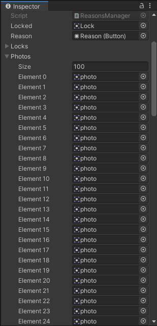
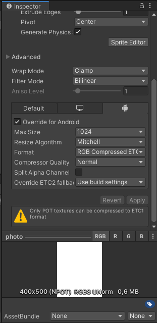

<h1 id="title" align="center">You and I</h1>

  <a href="#description">Description</a> |
  <a href="#preview">Preview</a> |
  <a href="#technologies">Technologies</a> |
  <a href="#how-to-use">How to use</a> |
  <a href="#info">Additional Information</a> |
  <a href="#license">License</a>

<h2 id="description">📑️ Description</h2>

  You and I is an application in which you add photos and messages showing the reasons why you are in love with someone, and send that application to that someone to install on your smartphone, open it and be sure of the love you have for him / her !

<h2 id="preview">📽️ Preview</h2>

<table width="100%">
  <tr>
    <th>Opening</th>
    <th>Messages</th>
  </tr>
  <tr>
    <td align="center">
      
    </td>
    <td align="center">
      
    </td>
  </tr>
</table>

<h2 id="technologies">💻️ Technologies</h2>
<ul>
  <li>🛠️ Engine: Unity3D</li>
  <li>📱️ Design: Photoshop CS6</li>
  <li>⌨️ Programming Language: C#</li>
</ul>

<h2 id="how-to-use">👨🏽‍💻️ How to use</h2>

<h5>Note: You need to have Unity and the Android SDK installed on your machine.</h5>

<ol>
  <li>Put your and your lover names in text 'You and I' and in Icon.png</li>
  <li>Replace the 'Message' text with an affectionate introduction</li>
  <li>Set up time animations in script 'Loading.cs'</li>
  
  <table width="100%">
    <tr align="center">
      <th>
        <li>Set up each reason text</li>
      </th>
      <th>
        <li>Set up each reason image (The image format is 4:5)</li>
      </th>
    </tr>
    <tr align="center">
      <td>
        
      </td>
      <td>
        
      </td>
    </tr>
  </table>
  <table width="100%">
    <tr align="center">
      <th>
        <li>Set up each song (You can edit the number of songs too)</li>
      </th>
      <th>
        <li>On each photo override settings for android and edit 'Max size' to 512</li>
      </th>
    </tr>
    <tr align="center">
      <td>
        
      </td>
      <td>
        
      </td>
    </tr>
  </table>
  <li>Build the apk file and send to your lover ❣️</li>
</ol>

<h2 id="info">📌️ Additional Information</h2>
<h3 id="status">&nbsp;&nbsp;&nbsp;&nbsp;&nbsp;&nbsp;&nbsp;&nbsp;🔎️ Project Status</h3>

&nbsp;&nbsp;&nbsp;&nbsp;&nbsp;&nbsp;&nbsp;&nbsp;&nbsp;&nbsp;&nbsp;&nbsp;&nbsp;&nbsp;&nbsp;&nbsp;This project is finished. ✔️

<h3 id="contributing">&nbsp;&nbsp;&nbsp;&nbsp;&nbsp;&nbsp;&nbsp;&nbsp;📊️ Contributing</h3>

&nbsp;&nbsp;&nbsp;&nbsp;&nbsp;&nbsp;&nbsp;&nbsp;&nbsp;&nbsp;&nbsp;&nbsp;&nbsp;&nbsp;&nbsp;&nbsp;To contribute to the project in any way, it is necessary to fork the repository and follow the instructions in the section above, make your changes and / or updates and submit a pull request. I am open to all suggestions!

<h3 id="feedback-support">&nbsp;&nbsp;&nbsp;&nbsp;&nbsp;&nbsp;&nbsp;&nbsp;💬️ Feedback and Support</h3>

&nbsp;&nbsp;&nbsp;&nbsp;&nbsp;&nbsp;&nbsp;&nbsp;&nbsp;&nbsp;&nbsp;&nbsp;&nbsp;&nbsp;&nbsp;&nbsp;If you have any questions about the project, how to contribute or want to send me some feedback, feel free to contact me through my e-mail adress clicking <a href="https://mail.google.com/mail/u/0/?view=cm&fs=1&to=misael.costa@ccc.ufcg.edu.br&su=(Feedback or Support) for 'You and I'&tf=1">here</a>.

<h2 id="license">📜️ License</h2>

  

    This project is under license from MIT. See the <a href="LICENSE">LICENSE</a> file for more details.
  

  

    <a href="#cover">Back to top ⬆️</a>
  

---

Developed with 💙️ by Misael Augusto

